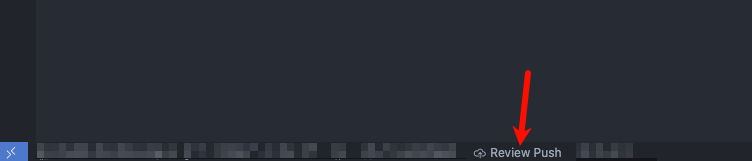

# Gerrit Review Push

  <a href="#中文"><strong>中文</strong></a> · <a href="#english"><strong>English</strong></a>

<strong>中文</strong>

在一个面板里**批量**选择多个项目的“未合入上游”的 commit，并一键 `push` 到 Gerrit 的 `refs/for/<branch>` 发起 Review；同时支持在面板里维护可选分支、配置 push 前缀，以及直接改 commit message。

> 适用：你的团队使用 Gerrit（`refs/for/*`）工作流。

---

## 它能做什么

- **状态栏一键入口**：点击状态栏 `Review Push` 打开面板。
- **自动扫描 workspace**：找出当前 workspace 中**“领先 upstream（ahead）”** 的仓库，并列出可 push 的 commit。
- **批量 push（一个窗口搞定）**：
  - 左侧勾选要 push 的项目（可全选/全不选）
  - 每个项目只能选 **1 个 commit**（选最新 commit 会连同父提交一起推上去，这是 Gerrit review-push 的常见行为）
  - 为每个项目选择目标分支（`refs/for/<branch>`）
- **Target branches 管理**：在面板里对可选分支 **Add / Edit / Delete**（本地保存，不会改你仓库文件）。
- **Push prefix 可配置**：把 `push <remote> $SHA:refs/for/` 做成输入框保存；之后新增/编辑分支只需要填 `feature/1.1.0` 这种分支名。
- **Open Gerrit after push**：若勾选此项，则在push 成功后可自动打开 Gerrit 网页
- **Edit commit message（在面板内）**
  - 选中 commit 后点 `Edit msg`，可修改该 commit 的 message。
  - `HEAD`：用 `git commit --amend`（只改 message）
  - 非 `HEAD`：用脚本化 `git rebase -i` + `reword`（会重写历史、SHA 会变化）

---

## 使用方法（一步一步）

1. 打开一个 Git 仓库（单项目）或一个包含多个 Git 仓库的 workspace（多项目）。
2. 点击 VSCode 状态栏的 `Review Push`。
   1. 
3. 面板会扫描当前打开的仓库，并只展示“存在可 review-push 的提交”的项目（即领先 upstream / ahead 的仓库）：
   - **Project**：项目名 + 当前分支
   - **Commit**：该项目领先 upstream 的 commit 列表
   - **Target branch**：选择要 review-push 到的目标分支
4. （可选）勾选 `Open Gerrit after push`。
5. 点击 `Push selected`。

---

## Target branches 与 Prefix

### 1) Prefix（只需设置一次）

在 `Target branches` 面板顶部有 `Command prefix` 输入框：

- 格式要求：`push <remote> $SHA:refs/for/`
- 示例：`push origin $SHA:refs/for/`

设置后会本地保存，后续所有分支命令都会按这个 prefix 拼出来。

### 2) 分支列表

- 默认只有一个分支：`master`
- 你可以在 UI 里：
  - `Add branch`：新增分支（只填 `feature/1.1.0` 这种路径）
  - `Edit`：编辑分支名
  - `Delete`：删除分支（至少要保留 1 个分支）

---

## Edit commit message（重要：会影响历史）

### HEAD commit

- 走 `git commit --amend` 更新 message
- **要求**：不能有 staged changes（否则 amend 可能把内容带进去）

### 非 HEAD commit

- 走 `git rebase -i` 的 `reword`
- **会重写历史**：目标 commit 以及其后的 commit SHA 都会变化
- 插件会在第一次要求你确认一次，之后不再反复弹确认

<strong>English</strong>

Bulk-select “commits not yet merged to upstream” across multiple projects in one panel, and push them to Gerrit `refs/for/<branch>` to start a review. You can also manage target branches, configure the push prefix, and edit commit messages directly in the panel.

> Best for: teams using the Gerrit review workflow (`refs/for/*`).

---

## What it can do

- **One-click entry in the Status Bar**: click `Review Push` to open the panel.
- **Scan the current workspace**: find repos in the workspace that are **ahead of upstream**, and list commits you can push.
- **Bulk push (one window)**:
  - Select which projects to push (Select all / Select none)
  - Each project can pick **only one commit** (pushing the newest commit will also include its parent commits; this is the common Gerrit review-push behavior)
  - Choose a target branch for each project (`refs/for/<branch>`)
- **Manage target branches**: Add / Edit / Delete branches in the panel (saved locally; does not modify your repo files).
- **Configurable push prefix**: save `push <remote> $SHA:refs/for/` once; after that, adding/editing branches only needs the branch name (e.g. `feature/1.1.0`).
- **Open Gerrit after push**: when enabled, the extension opens the Gerrit page automatically after a successful push.
- **Edit commit message (in the panel)**:
  - Click `Edit msg` to edit the selected commit message.
  - `HEAD`: uses `git commit --amend` (message only)
  - Non-`HEAD`: uses a scripted `git rebase -i` + `reword` (rewrites history; SHAs will change)

---

## How to use (step-by-step)

1. Open a Git repo (single project), or a workspace that contains multiple Git repos (multi-project).
2. Click `Review Push` in the VSCode status bar.
   1. 
3. The panel scans your opened repos and only lists projects that have “review-pushable” commits (i.e. repos that are ahead of upstream):
   - **Project**: project name + current branch
   - **Commit**: commits that are ahead of upstream
   - **Target branch**: the branch you want to review-push to
4. (Optional) enable `Open Gerrit after push`.
5. Click `Push selected`.

---

## Target branches & Prefix

### 1) Prefix (set once)

In the `Target branches` panel, there is a `Command prefix` input:

- Required format: `push <remote> $SHA:refs/for/`
- Example: `push origin $SHA:refs/for/`

It is saved locally. All branch commands will be built from this prefix.

### 2) Branch list

- Default branch: `master`
- In the UI you can:
  - `Add branch`: add a branch name like `feature/1.1.0`
  - `Edit`: rename the branch
  - `Delete`: remove the branch (at least one branch must remain)

---

## Edit commit message (important: it can rewrite history)

### HEAD commit

- Uses `git commit --amend` to update the message.
- **Requirement**: no staged changes (otherwise amend may include staged changes).

### Non-HEAD commit

- Uses `git rebase -i` with `reword`.
- **Rewrites history**: the selected commit and all descendant commits will get new SHAs.
- The extension asks you to acknowledge this once; after that it won’t ask again.

